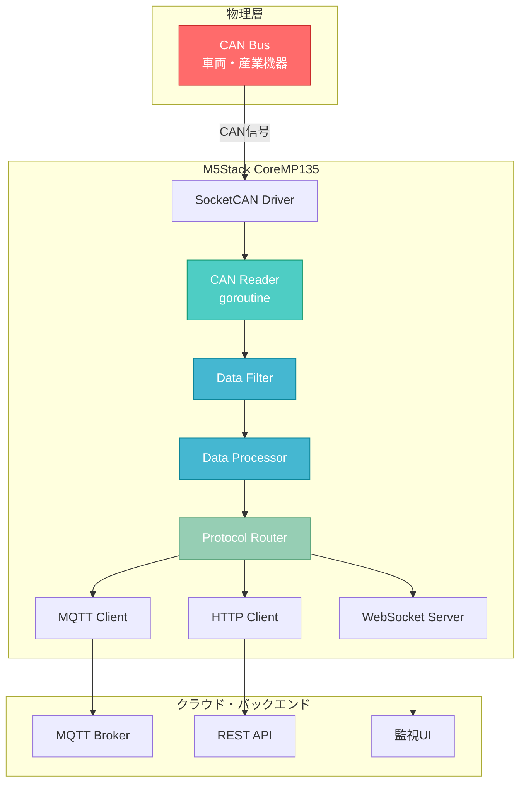
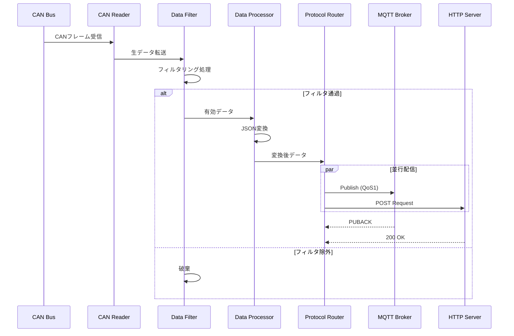
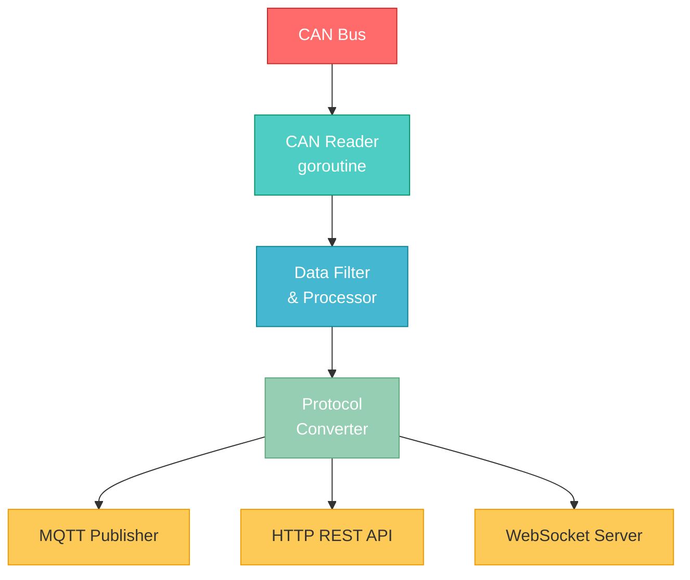
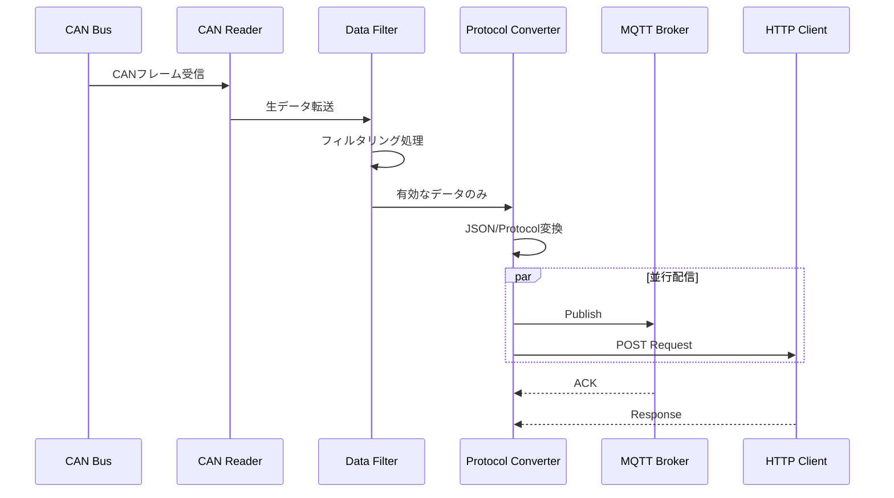

# CAN Gateway Application for M5Stack CoreMP135


M5Stack CoreMP135をハードウェアプラットフォームとして利用し、CANバス通信を介して産業機器や車両からデータを収集し、クラウドプラットフォームへ転送するIoTゲートウェイアプリケーションです。

> **📚 詳細なドキュメントは[こちら](https://tinayla696.github.io/mp135_gateway_go/)をご覧ください**

## 📋 目次

- [概要](#-概要)
- [主な機能](#-主な機能)
- [技術スタック](#️-技術スタック)
- [クイックスタート](#-クイックスタート)
- [アーキテクチャ](#️-アーキテクチャ)
- [ユースケース](#-ユースケース)
- [開発](#-開発)
- [ドキュメント](#-ドキュメント)
- [ライセンス](#-ライセンス)

## 📋 概要

このプロジェクトは、産業用機器や車載システムで広く使用されているCANバス通信をIoTシステムに統合するためのゲートウェイアプリケーションです。M5Stack CoreMP135の強力な処理能力（ARM Cortex-A7デュアルコア、512MB RAM）とGo言語の並行処理機能（goroutine）を活用し、高速で信頼性の高いデータ転送を実現します。

### 主な特徴

- ⚡ **高速処理**: 500 CAN frames/sec の処理能力
- 🔄 **プロトコル変換**: CAN → MQTT/HTTP/WebSocket へのシームレスな変換
- 🛡️ **堅牢性**: エラーハンドリング、自動リトライ、Dead Letter Queue対応
- 📊 **データフィルタリング**: CAN IDやデータ内容による柔軟なフィルタリング
- 📝 **構造化ログ**: JSON形式の詳細なログ出力
- 🔧 **設定可能**: YAML設定ファイルによる動的な動作変更
- � **監視機能**: ヘルスチェックAPI、メトリクス収集

## 🚀 主な機能

| 機能分類 | 機能概要 |
|---------|---------|
| **CAN通信** | SocketCANを使用した高速CANバスデータ受信・送信 |
| **データ変換** | CANフレーム → JSON/Protocol Buffer変換 |
| **プロトコル対応** | MQTT 3.1.1/5.0, HTTP/1.1, WebSocket |
| **フィルタリング** | CAN ID・データ内容によるフィルタリング |
| **ログ管理** | 構造化ログ出力・自動ローテーション |
| **監視機能** | ヘルスチェックAPI、Prometheusメトリクス対応 |

## 🏗️ 技術スタック

### バッジ


### 技術仕様

| 項目 | 仕様 |
|-----|------|
| **開発言語** | Go 1.21+ |
| **ハードウェア** | M5Stack CoreMP135 (ARM Cortex-A7, 512MB RAM) |
| **OS** | Linux (Buildroot) |
| **CANインターフェース** | SocketCAN (/dev/can0) |
| **対応プロトコル** | MQTT 3.1.1/5.0, HTTP/1.1, WebSocket |
| **処理性能** | 500 CAN frames/sec |
| **データ遅延** | <10ms (P95) |

## 🚀 クイックスタート

### 前提条件

```bash
# Go 1.21以上
go version
# go version go1.21.0 linux/amd64

# M5Stack CoreMP135への接続
ping <M5Stack_IP>
```

### インストール

#### ローカルビルド

```bash
# リポジトリのクローン
git clone https://github.com/tinayla696/mp135_gateway_go.git
cd mp135_gateway_go

# 依存関係のインストール
go mod download

# ビルド
make build

# 実行
./bin/can_gateway -config configs/config.yaml
```

#### M5Stack CoreMP135向けクロスコンパイル

```bash
# ARM64向けビルド
make build-arm64

# デバイスへ転送
scp bin/can_gateway_arm64 root@<M5Stack_IP>:/usr/local/bin/can_gateway
scp configs/config.yaml root@<M5Stack_IP>:/etc/can_gateway/

# SSH接続して起動
ssh root@<M5Stack_IP>
can_gateway -config /etc/can_gateway/config.yaml
```

### 設定ファイル例

```yaml
# configs/config.yaml
can:
  interface: "can0"
  baudrate: 500000
  mode: "normal"

mqtt:
  broker: "ssl://mqtt.example.com:8883"
  client_id: "can-gateway-001"
  topic_prefix: "vehicle/can"
  qos: 1

http:
  endpoint: "https://api.example.com/v1/can/data"
  timeout: 10s

websocket:
  enabled: true
  listen_addr: ":8080"

filter:
  rules_file: "./configs/filter_rules.json"

logging:
  level: "info"
  format: "json"
```

## 🏛️ アーキテクチャ

### システム構成図



### データフロー



詳細なアーキテクチャ設計については、[アーキテクチャ設計書](docs/architecture.md)をご覧ください。

## 💼 ユースケース

### 1. 車両データ収集 🚗

車両のECU（Engine Control Unit）からリアルタイムデータ収集：

- エンジン回転数（RPM）
- 車速
- 燃料消費量
- エンジン温度
- DTC（Diagnostic Trouble Code）

### 2. 産業機器監視 🏭

製造ラインや重機の稼働状態監視：

- 稼働時間・停止時間
- センサーデータ（温度、圧力、振動）
- アラーム情報
- メンテナンス予兆検知

### 3. 建設機械フリート管理 🚜

複数の建設機械の位置・稼働状況を一元管理：

- GPS位置情報連携
- 燃料残量監視
- 稼働時間集計
- 遠隔診断

## 🧪 テスト

### 単体テスト

```bash
# 全テスト実行
make test

# カバレッジ付き
go test -cover ./...

# カバレッジレポート生成
go test -coverprofile=coverage.out ./...
go tool cover -html=coverage.out
```

### E2Eテスト（仮想CAN使用）

```bash
# 仮想CANインターフェース作成
sudo modprobe vcan
sudo ip link add dev vcan0 type vcan
sudo ip link set up vcan0

# テスト実行
go test -tags=e2e ./tests/e2e/...
```

## 📝 開発

### プロジェクト構造

```
mp135_gateway_go/
├── cmd/
│   └── gateway/          # メインエントリーポイント
├── internal/             # 内部パッケージ
│   ├── can/              # CAN通信関連
│   ├── filter/           # データフィルタリング
│   ├── processor/        # データ処理・変換
│   ├── protocol/         # プロトコル送信
│   │   ├── mqtt/
│   │   ├── http/
│   │   └── websocket/
│   ├── config/           # 設定管理
│   └── logger/           # ログ管理
├── pkg/                  # 外部公開パッケージ
├── configs/              # 設定ファイル
├── docs/                 # ドキュメント (MkDocs)
├── scripts/              # ビルド・デプロイスクリプト
└── tests/                # テストコード
```

### ブランチ戦略

| Prefix | 用途 | 例 |
| :--- | :--- | :--- |
| `main` | 本番環境 | - |
| `develop` | 開発環境 | - |
| `feature/` | 新機能追加 | `feature/add-websocket` |
| `bugfix/` | バグ修正 | `bugfix/mqtt-reconnect` |
| `hotfix/` | 緊急修正 | `hotfix/security-patch` |
| `docs/` | ドキュメント更新 | `docs/update-readme` |

### コーディング規約

- Go標準のコーディング規約に準拠
- `gofmt`、`golint`、`golangci-lint`によるコード整形
- 単体テストカバレッジ80%以上を目標
- コミットメッセージは[Conventional Commits](https://www.conventionalcommits.org/)形式

```bash
# コードフォーマット
make fmt

# Lint実行
make lint

# 全チェック
make check
```

### コントリビューション

プルリクエストを歓迎します！以下の手順に従ってください：

1. このリポジトリをフォーク
2. フィーチャーブランチを作成 (`git checkout -b feature/amazing-feature`)
3. 変更をコミット (`git commit -m 'feat: add amazing feature'`)
4. ブランチにプッシュ (`git push origin feature/amazing-feature`)
5. プルリクエストを作成

詳細は[開発ガイド](docs/development.md)をご覧ください。

## 📚 ドキュメント

このプロジェクトは、MkDocsを使用した詳細なドキュメントを提供しています。

### ドキュメント構成

| ドキュメント | 内容 |
|------------|-----|
| [アーキテクチャ設計書](docs/architecture.md) | システム設計、コンポーネント構成、データフロー |
| [API仕様](docs/api.md) | REST API、WebSocket API、MQTTトピック仕様 |
| [運用ガイド](docs/operations.md) | デプロイ、監視、トラブルシューティング |
| [開発ガイド](docs/development.md) | 開発環境セットアップ、コーディング規約、テスト |

### ドキュメントのビルド

```bash
# MkDocsインストール
pip install -r requirements.txt

# ローカルでプレビュー
mkdocs serve

# ブラウザで http://127.0.0.1:8000 を開く

# 静的サイトビルド
mkdocs build
```

## 🚢 デプロイ

### systemdサービス化

```bash
# サービスファイル配置
sudo cp scripts/can_gateway.service /etc/systemd/system/

# サービス有効化・起動
sudo systemctl daemon-reload
sudo systemctl enable can_gateway
sudo systemctl start can_gateway

# ステータス確認
sudo systemctl status can_gateway
```

### Docker対応（予定）

```bash
# Dockerイメージビルド
docker build -t can-gateway:latest .

# コンテナ起動
docker run -d \
  --name can-gateway \
  --device=/dev/can0 \
  -v $(pwd)/configs:/etc/can_gateway \
  can-gateway:latest
```

## 🔒 セキュリティ

- MQTT: TLS 1.3対応、クライアント証明書認証
- HTTP: HTTPS必須、Bearer Token認証
- WebSocket: WSS（Secure WebSocket）、Origin検証
- 設定ファイル: 環境変数による機密情報管理

セキュリティ問題を発見した場合は、公開Issueではなく、直接メンテナーに連絡してください。

## 🗺️ ロードマップ

### Phase 1: 基本機能実装（進行中）

- [x] プロジェクト構造設計
- [x] アーキテクチャ設計
- [x] ドキュメント作成
- [ ] CAN Reader実装
- [ ] データフィルター実装
- [ ] MQTT Publisher実装
- [ ] HTTP Client実装
- [ ] 単体テスト作成

### Phase 2: 高度な機能（計画中）

- [ ] データベース永続化（SQLite/PostgreSQL）
- [ ] ルールエンジン実装
- [ ] OTA（Over-The-Air）アップデート
- [ ] Prometheus Exporter
- [ ] gRPC対応
- [ ] Web管理UI

### Phase 3: 運用強化（検討中）

- [ ] Kubernetes対応
- [ ] 分散配置・冗長化
- [ ] メッセージキュー統合（Kafka/RabbitMQ）
- [ ] AI/ML統合（異常検知）

## 📊 パフォーマンス

### 目標値

| 指標 | 目標 |
|------|------|
| CAN受信レート | 500 frames/sec |
| データ処理遅延 | < 10ms (P95) |
| CPU使用率 | < 70% |
| メモリ使用量 | < 300MB |

### ベンチマーク（予定）

```bash
# ベンチマーク実行
go test -bench=. -benchmem ./...
```

## 📄 ライセンス

このプロジェクトは[MITライセンス](LICENSE)の下で公開されています。

## 👥 作者・貢献者

- **tinayla696** - *Initial work* - [GitHub](https://github.com/tinayla696)

貢献者一覧は[Contributors](https://github.com/tinayla696/mp135_gateway_go/graphs/contributors)をご覧ください。

## 🙏 謝辞

- [M5Stack](https://m5stack.com/) - CoreMP135の素晴らしいハードウェア
- [Go Community](https://go.dev/) - 優れたプログラミング言語とエコシステム
- [Eclipse Paho](https://www.eclipse.org/paho/) - MQTTクライアントライブラリ
- [SocketCAN](https://www.kernel.org/doc/html/latest/networking/can.html) - Linux CANバスサポート

## 📞 サポート・お問い合わせ

- **Issues**: [GitHub Issues](https://github.com/tinayla696/mp135_gateway_go/issues)
- **Discussions**: [GitHub Discussions](https://github.com/tinayla696/mp135_gateway_go/discussions)
- **Email**: support@example.com（準備中）

## 📈 ステータス


---

<p align="center">
  Made with ❤️ for IoT and Industrial Applications
  <br>
  <a href="https://tinayla696.github.io/mp135_gateway_go/">📚 ドキュメント</a> •
  <a href="https://github.com/tinayla696/mp135_gateway_go/issues">🐛 バグ報告</a> •
  <a href="https://github.com/tinayla696/mp135_gateway_go/discussions">💬 ディスカッション</a>
</p>

## 🚀 セットアップ

### 前提条件

- Go 1.21以上がインストールされていること
- M5Stack CoreMP135デバイス
- CANバスインターフェース設定済み

### インストール

```bash
# リポジトリのクローン
git clone https://github.com/tinayla696/mp135_gateway_go.git
cd mp135_gateway_go

# 依存関係のインストール
go mod download

# ビルド
go build -o can_gateway ./src/main.go

# 実行
./can_gateway
```

### クロスコンパイル (M5Stack用)

```bash
# ARM64向けビルド
GOOS=linux GOARCH=arm64 go build -o can_gateway_arm64 ./src/main.go

# デバイスへ転送
scp can_gateway_arm64 root@<M5Stack_IP>:/usr/local/bin/can_gateway
```

## ⚙️ 設定

設定ファイル `config.yaml` をプロジェクトルートに配置してください。

```yaml
can:
  interface: "can0"
  baudrate: 500000

mqtt:
  broker: "tcp://localhost:1883"
  client_id: "can_gateway"
  topic: "can/data"

filters:
  - id: 0x123
  - id: 0x456
```

## 📖 使い方

### 基本的な起動

```bash
./can_gateway --config config.yaml
```

### オプション

```bash
./can_gateway --help
  -config string
        設定ファイルのパス (default "config.yaml")
  -log-level string
        ログレベル (debug, info, warn, error) (default "info")
  -version
        バージョン情報を表示
```

## 🏛️ アーキテクチャ



### データフロー



## 🧪 テスト

```bash
# 全テスト実行
go test ./...

# カバレッジ付き
go test -cover ./...

# ベンチマーク
go test -bench=. ./...
```

## 📝 開発

### ブランチ戦略

| Prefix | 用途 | 例 |
| :--- | :--- | :--- |
| `feature/` | 新機能追加 | `feature/add-websocket` |
| `bugfix/` | バグ修正 | `bugfix/mqtt-reconnect` |
| `docs/` | ドキュメント更新 | `docs/update-readme` |

### コントリビューション

1. このリポジトリをフォーク
2. フィーチャーブランチを作成 (`git checkout -b feature/amazing-feature`)
3. 変更をコミット (`git commit -m 'Add amazing feature'`)
4. ブランチにプッシュ (`git push origin feature/amazing-feature`)
5. プルリクエストを作成

## 📄 ライセンス

このプロジェクトはMITライセンスの下でライセンスされています。詳細は [LICENSE](LICENSE) ファイルを参照してください。

## 👥 作者

- **tinayla696** - [GitHub](https://github.com/tinayla696)

## 🙏 謝辞

- M5Stack CoreMP135の素晴らしいハードウェア
- Go言語コミュニティ
- CANバス通信に関する各種オープンソースライブラリ

## � サポート

問題が発生した場合やご質問がある場合は、[Issues](https://github.com/tinayla696/mp135_gateway_go/issues)ページでお知らせください。

---

Made with ❤️ for IoT and Industrial Applications