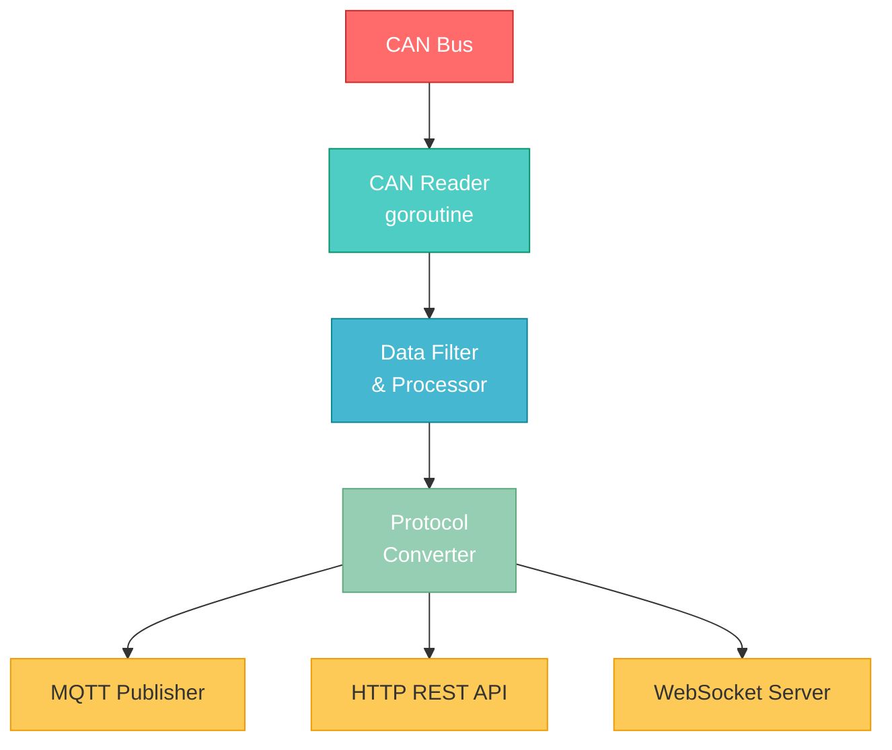
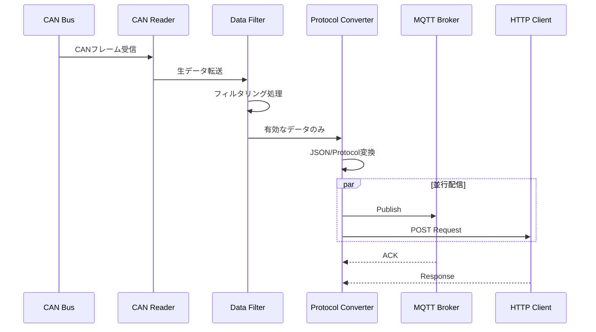

# CAN Gateway Application for M5Stack CoreMP135


M5Stack CoreMP135を使用したCANバス通信ゲートウェイアプリケーション。CANバスからのデータを受信し、処理・変換してクラウドやローカルネットワークに転送するIoTゲートウェイシステムです。

## 📋 概要

このプロジェクトは、産業用機器や車載システムで広く使用されているCANバス通信をIoTシステムに統合するためのゲートウェイアプリケーションです。M5Stack CoreMP135の強力な処理能力とGo言語の並行処理機能を活用し、高速で信頼性の高いデータ転送を実現します。

### 主な機能

- 🚀 **高速CAN通信**: CANバスからのリアルタイムデータ受信・処理
- 🔄 **プロトコル変換**: CAN → MQTT/HTTP/WebSocket
- 📊 **データフィルタリング**: 必要なデータのみを抽出・転送
- 🔧 **設定可能**: YAML/JSON形式の設定ファイルによる柔軟な設定
- 📡 **マルチプロトコル対応**: MQTT, HTTP REST API, WebSocket
- 🛡️ **エラーハンドリング**: 堅牢なエラー処理と自動リトライ機能
- 📝 **ログ管理**: 構造化ログによる詳細な動作記録

## 🏗️ 技術スタック


### 開発環境

- **言語**: Go 1.21+
- **ハードウェア**: M5Stack CoreMP135
- **OS**: Linux (Buildroot)
- **通信**: CAN Bus, MQTT, HTTP
- **ビルドツール**: Go Modules, Make

## 🚀 セットアップ

### 前提条件

- Go 1.21以上がインストールされていること
- M5Stack CoreMP135デバイス
- CANバスインターフェース設定済み

### インストール

```bash
# リポジトリのクローン
git clone https://github.com/tinayla696/mp135_gateway_go.git
cd mp135_gateway_go

# 依存関係のインストール
go mod download

# ビルド
go build -o can_gateway ./src/main.go

# 実行
./can_gateway
```

### クロスコンパイル (M5Stack用)

```bash
# ARM64向けビルド
GOOS=linux GOARCH=arm64 go build -o can_gateway_arm64 ./src/main.go

# デバイスへ転送
scp can_gateway_arm64 root@<M5Stack_IP>:/usr/local/bin/can_gateway
```

## ⚙️ 設定

設定ファイル `config.yaml` をプロジェクトルートに配置してください。

```yaml
can:
  interface: "can0"
  baudrate: 500000

mqtt:
  broker: "tcp://localhost:1883"
  client_id: "can_gateway"
  topic: "can/data"

filters:
  - id: 0x123
  - id: 0x456
```

## 📖 使い方

### 基本的な起動

```bash
./can_gateway --config config.yaml
```

### オプション

```bash
./can_gateway --help
  -config string
        設定ファイルのパス (default "config.yaml")
  -log-level string
        ログレベル (debug, info, warn, error) (default "info")
  -version
        バージョン情報を表示
```

## 🏛️ アーキテクチャ



### データフロー



## 🧪 テスト

```bash
# 全テスト実行
go test ./...

# カバレッジ付き
go test -cover ./...

# ベンチマーク
go test -bench=. ./...
```

## 📝 開発

### ブランチ戦略

| Prefix | 用途 | 例 |
| :--- | :--- | :--- |
| `feature/` | 新機能追加 | `feature/add-websocket` |
| `bugfix/` | バグ修正 | `bugfix/mqtt-reconnect` |
| `docs/` | ドキュメント更新 | `docs/update-readme` |

### コントリビューション

1. このリポジトリをフォーク
2. フィーチャーブランチを作成 (`git checkout -b feature/amazing-feature`)
3. 変更をコミット (`git commit -m 'Add amazing feature'`)
4. ブランチにプッシュ (`git push origin feature/amazing-feature`)
5. プルリクエストを作成

## 📄 ライセンス

このプロジェクトはMITライセンスの下でライセンスされています。詳細は [LICENSE](LICENSE) ファイルを参照してください。

## 👥 作者

- **tinayla696** - [GitHub](https://github.com/tinayla696)

## 🙏 謝辞

- M5Stack CoreMP135の素晴らしいハードウェア
- Go言語コミュニティ
- CANバス通信に関する各種オープンソースライブラリ

## � サポート

問題が発生した場合やご質問がある場合は、[Issues](https://github.com/tinayla696/mp135_gateway_go/issues)ページでお知らせください。

---

Made with ❤️ for IoT and Industrial Applications