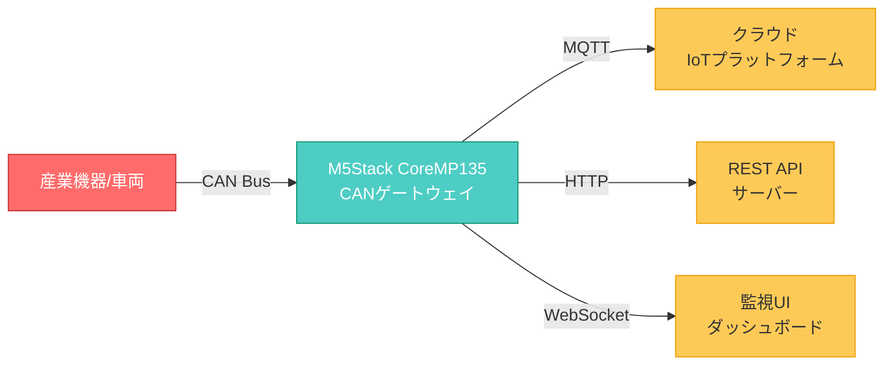

# CAN Gateway Application - 技術仕様書


## プロジェクト概要

本プロジェクトは、**M5Stack CoreMP135**をハードウェアプラットフォームとして利用し、CANバス通信を介して産業機器や車両からデータを収集し、クラウドプラットフォームへ転送するIoTゲートウェイアプリケーションです。

### 主な特徴

- ⚡ **高速処理**: Go言語のgoroutineによる並行処理で500 frames/secの処理能力
- 🔄 **プロトコル変換**: CAN → MQTT/HTTP/WebSocketへのシームレスな変換
- 🛡️ **堅牢性**: エラーハンドリング、自動リトライ、Dead Letter Queue対応
- 📊 **監視**: Prometheus対応メトリクス、ヘルスチェックAPI
- 🔧 **柔軟な設定**: YAML設定ファイルによる動的な動作変更

## システム構成



## ユースケース

### 1. 車両データ収集

車両のECU（Engine Control Unit）から以下のデータをリアルタイム収集：

- エンジン回転数（RPM）
- 車速
- 燃料消費量
- エンジン温度
- エラーコード（DTC）

### 2. 産業機器監視

製造ラインや重機の稼働状態を監視：

- 稼働時間
- センサーデータ（温度、圧力、振動）
- アラーム情報
- メンテナンス予兆検知

### 3. 建設機械フリート管理

複数の建設機械の位置情報・稼働状況を一元管理：

- GPS位置情報連携
- 燃料残量監視
- 稼働時間集計
- 遠隔診断

## 技術仕様サマリー

| 項目 | 仕様 |
|-----|------|
| **開発言語** | Go 1.21+ |
| **ハードウェア** | M5Stack CoreMP135 (ARM Cortex-A7, 512MB RAM) |
| **OS** | Linux (Buildroot) |
| **CANインターフェース** | SocketCAN (/dev/can0) |
| **対応プロトコル** | MQTT 3.1.1/5.0, HTTP/1.1, WebSocket |
| **処理性能** | 500 CAN frames/sec |
| **データ遅延** | <10ms (P95) |

## ドキュメント構成

このドキュメントサイトは、以下のセクションで構成されています：

### 📐 [アーキテクチャ設計書](architecture.md)

システムの全体設計、コンポーネント構成、データフロー、並行処理モデルなどの詳細設計情報を記載しています。

**含まれる内容:**

- システム概要・技術選定理由
- 全体構成図・データフロー図
- コンポーネント設計
- データモデル定義
- エラーハンドリング戦略
- セキュリティ設計
- 性能要件

### 🔌 [API仕様](api.md)

ゲートウェイが提供する各種APIのエンドポイント、リクエスト/レスポンス形式、認証方法などを定義しています。

### 🚀 [運用ガイド](operations.md)

デプロイ方法、監視・ログ管理、トラブルシューティング、バックアップ・リカバリなどの運用手順を記載しています。

### 💻 [開発ガイド](development.md)

開発環境のセットアップ、コーディング規約、テスト方法、ビルド手順、デバッグ方法などの開発者向け情報を提供しています。

## クイックスタート

### 前提条件

```bash
# Go 1.21以上
go version

# M5Stack CoreMP135への接続
ssh root@<M5Stack_IP>
```

### インストール

=== "ローカルビルド"

    ```bash
    # リポジトリクローン
    git clone https://github.com/tinayla696/mp135_gateway_go.git
    cd mp135_gateway_go
    
    # 依存関係インストール
    go mod download
    
    # ビルド
    go build -o bin/can_gateway ./cmd/gateway/main.go
    
    # 実行
    ./bin/can_gateway -config configs/config.yaml
    ```

=== "クロスコンパイル (M5Stack用)"

    ```bash
    # ARM64向けビルド
    GOOS=linux GOARCH=arm64 go build \
      -ldflags="-s -w" \
      -o bin/can_gateway_arm64 \
      ./cmd/gateway/main.go
    
    # デバイスへ転送
    scp bin/can_gateway_arm64 root@<M5Stack_IP>:/usr/local/bin/can_gateway
    scp configs/config.yaml root@<M5Stack_IP>:/etc/can_gateway/
    
    # SSH接続して起動
    ssh root@<M5Stack_IP>
    can_gateway -config /etc/can_gateway/config.yaml
    ```

### 設定ファイル例

```yaml title="configs/config.yaml"
can:
  interface: "can0"
  baudrate: 500000

mqtt:
  broker: "ssl://mqtt.example.com:8883"
  client_id: "can-gateway-001"
  topic_prefix: "vehicle/can"
  qos: 1

filter:
  rules_file: "./configs/filter_rules.json"

logging:
  level: "info"
  format: "json"
```

## プロジェクトステータス

### 現在の開発フェーズ

!!! info "Phase 1: 基本機能実装 (進行中)"
    - [x] プロジェクト構造設計
    - [x] アーキテクチャ設計
    - [ ] CAN Reader実装
    - [ ] データフィルター実装
    - [ ] MQTT Publisher実装
    - [ ] HTTP Client実装
    - [ ] 単体テスト作成

### 今後の予定

!!! note "Phase 2: 高度な機能 (計画中)"
    - データベース永続化
    - ルールエンジン
    - OTAアップデート機能
    - Prometheus Exporter

## ライセンス

このプロジェクトは[MITライセンス](https://opensource.org/licenses/MIT)の下で公開されています。

## 貢献

プルリクエストを歓迎します！詳細は[開発ガイド](development.md)をご覧ください。

## サポート

質問や問題が発生した場合は、[GitHubのIssues](https://github.com/tinayla696/mp135_gateway_go/issues)でお知らせください。

---

!!! tip "ドキュメント更新日"
    最終更新: 2026年1月3日