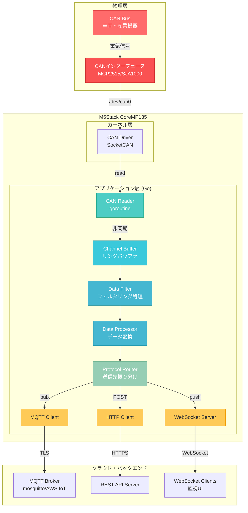
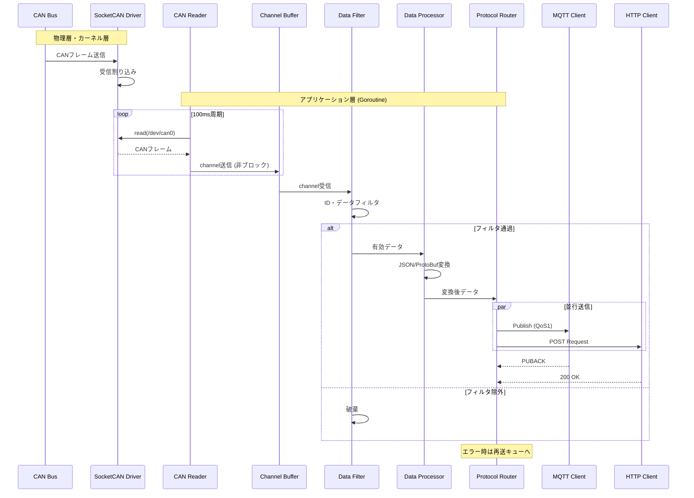
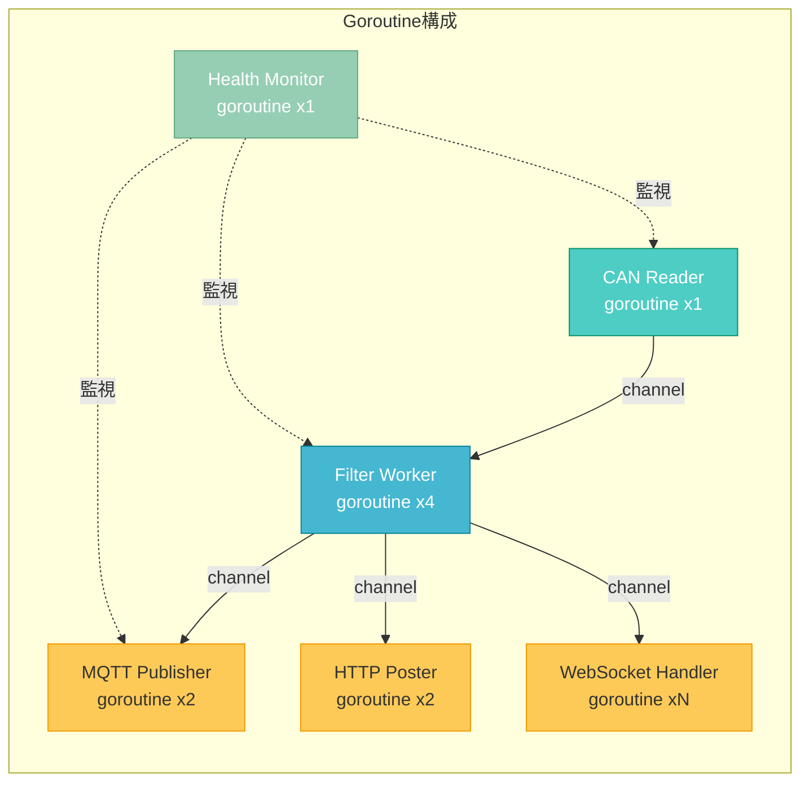
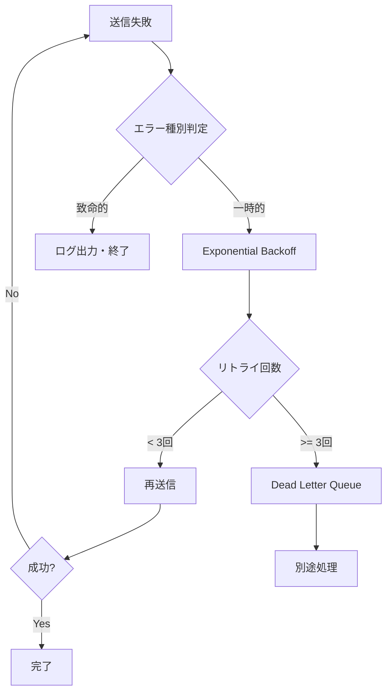

# アーキテクチャ設計書

## 1. システム概要

### 1.1 プロジェクト目的

本プロジェクトは、M5Stack CoreMP135をハードウェアプラットフォームとして利用し、CANバス通信を行う産業機器や車両からデータを収集し、IoTプラットフォームへ転送するゲートウェイアプリケーションです。

### 1.2 主要機能

| 機能分類 | 機能概要 | 実装優先度 |
|---------|---------|----------|
| CAN通信 | CANバスからのデータ受信・送信 | 高 |
| データ変換 | CANフレーム→JSON/Protocol Buffer変換 | 高 |
| プロトコル対応 | MQTT/HTTP/WebSocket対応 | 高 |
| フィルタリング | CAN ID・データ内容によるフィルタリング | 中 |
| ログ管理 | 構造化ログ出力・ローテーション | 中 |
| 監視機能 | ヘルスチェック・メトリクス収集 | 低 |

### 1.3 技術選定理由

| 技術要素 | 選定理由 |
|---------|---------|
| **Go言語** | • 並行処理（goroutine）による高速データ処理<br>• クロスコンパイルが容易<br>• メモリ効率が良く組み込み機器に適している<br>• 標準ライブラリが豊富 |
| **M5Stack CoreMP135** | • ARM Cortex-A7デュアルコア（1.0GHz）<br>• 512MB DDR3メモリ<br>• Linux（Buildroot）が動作<br>• GPIOでCAN通信モジュール接続可能 |

## 2. システムアーキテクチャ

### 2.1 全体構成図



### 2.2 データフロー



### 2.3 並行処理モデル



## 3. コンポーネント設計

### 3.1 ディレクトリ構成

```
mp135_gateway_go/
├── cmd/
│   └── gateway/          # メインエントリーポイント
│       └── main.go
├── internal/
│   ├── can/              # CAN通信関連
│   │   ├── reader.go     # CANフレーム読み取り
│   │   └── writer.go     # CANフレーム書き込み
│   ├── filter/           # データフィルタリング
│   │   ├── id_filter.go
│   │   └── data_filter.go
│   ├── processor/        # データ処理・変換
│   │   ├── converter.go
│   │   └── validator.go
│   ├── protocol/         # プロトコル送信
│   │   ├── mqtt/
│   │   ├── http/
│   │   └── websocket/
│   ├── config/           # 設定管理
│   │   └── config.go
│   └── logger/           # ログ管理
│       └── logger.go
├── pkg/                  # 外部公開パッケージ
│   └── models/
│       └── can_frame.go
├── configs/              # 設定ファイル
│   ├── config.yaml
│   └── filter_rules.json
├── docs/                 # ドキュメント
├── scripts/              # ビルド・デプロイスクリプト
│   ├── build.sh
│   └── deploy.sh
├── go.mod
├── go.sum
├── Makefile
└── README.md
```

### 3.2 主要コンポーネント

#### 3.2.1 CAN Reader

**責務**: SocketCANからCANフレームを読み取り、チャネルに送信

```go
type CANReader interface {
    Start(ctx context.Context) error
    Stop() error
    GetFrameChannel() <-chan CANFrame
}
```

**主要メソッド**:
- `Start()`: 読み取りループ開始（goroutine起動）
- `Stop()`: 読み取り停止
- `GetFrameChannel()`: フレーム受信チャネル取得

#### 3.2.2 Data Filter

**責務**: CAN IDやデータ内容に基づくフィルタリング

```go
type DataFilter interface {
    Filter(frame CANFrame) (bool, error)
    AddRule(rule FilterRule) error
    RemoveRule(ruleID string) error
}
```

**フィルタルール例**:
```json
{
  "rules": [
    {
      "id": "engine_rpm",
      "can_id": "0x0C0",
      "enabled": true
    },
    {
      "id": "vehicle_speed",
      "can_id": "0x0D0",
      "enabled": true
    }
  ]
}
```

#### 3.2.3 Data Processor

**責務**: CANフレームをJSON/Protocol Bufferに変換

```go
type DataProcessor interface {
    Process(frame CANFrame) ([]byte, error)
    SetFormat(format string) error // "json" or "protobuf"
}
```

**出力JSON例**:
```json
{
  "timestamp": "2026-01-03T10:30:45.123Z",
  "can_id": "0x0C0",
  "data": "1A2B3C4D5E6F7890",
  "dlc": 8,
  "device_id": "gateway-001",
  "parsed": {
    "rpm": 2500,
    "temperature": 85.5
  }
}
```

#### 3.2.4 Protocol Router

**責務**: 送信先プロトコルへルーティング

```go
type ProtocolRouter interface {
    Route(data []byte, metadata Metadata) error
    RegisterPublisher(protocol string, pub Publisher) error
}

type Publisher interface {
    Publish(data []byte) error
    Close() error
}
```

## 4. データモデル

### 4.1 CANFrame構造体

```go
type CANFrame struct {
    Timestamp time.Time    // 受信タイムスタンプ
    ID        uint32       // CAN ID (11bit or 29bit)
    Data      [8]byte      // データペイロード
    DLC       uint8        // データ長 (0-8)
    IsExtended bool        // 拡張フォーマット
    IsRTR     bool         // リモートフレーム
}
```

### 4.2 設定データモデル

```yaml
# config.yaml
can:
  interface: "can0"
  baudrate: 500000
  mode: "normal"  # normal/loopback/listen-only

mqtt:
  broker: "ssl://mqtt.example.com:8883"
  client_id: "can-gateway-001"
  username: "gateway"
  password: "${MQTT_PASSWORD}"
  topic_prefix: "vehicle/can"
  qos: 1
  retain: false
  reconnect_interval: 5s

http:
  endpoint: "https://api.example.com/v1/can/data"
  timeout: 10s
  retry_count: 3
  headers:
    Authorization: "Bearer ${API_TOKEN}"

websocket:
  enabled: true
  listen_addr: ":8080"
  path: "/ws"
  
filter:
  rules_file: "./configs/filter_rules.json"
  
logging:
  level: "info"  # debug/info/warn/error
  format: "json"
  output: "stdout"
  file:
    enabled: true
    path: "/var/log/can_gateway.log"
    max_size: 100  # MB
    max_backups: 3
    max_age: 30    # days
```

## 5. エラーハンドリング戦略

### 5.1 エラー分類

| エラー種別 | 対応方法 | 例 |
|-----------|---------|-----|
| **回復可能** | リトライ後、再接続 | ネットワーク一時切断 |
| **一時的** | 待機後、再試行 | バッファフル |
| **致命的** | ログ出力後、プログラム終了 | デバイス未接続 |

### 5.2 リトライポリシー



## 6. セキュリティ設計

### 6.1 通信セキュリティ

| プロトコル | セキュリティ対策 |
|-----------|----------------|
| MQTT | TLS 1.3, クライアント証明書認証 |
| HTTP | HTTPS, Bearer Token認証 |
| WebSocket | WSS, Origin検証 |

### 6.2 認証情報管理

- 環境変数による機密情報管理
- 設定ファイルは`.gitignore`に追加
- デプロイ時はSecrets管理サービス利用（AWS Secrets Manager等）

## 7. 性能要件

### 7.1 スループット

| 指標 | 目標値 |
|------|--------|
| CAN受信レート | 500 frames/sec |
| データ処理遅延 | < 10ms (P95) |
| MQTT送信レート | 100 messages/sec |

### 7.2 リソース使用量

| リソース | 上限 |
|---------|-----|
| CPU使用率 | < 70% |
| メモリ使用量 | < 300MB |
| ディスクI/O | < 10MB/sec |

## 8. 監視・運用

### 8.1 メトリクス

```go
type Metrics struct {
    CANFramesReceived   int64
    CANFramesFiltered   int64
    MQTTPublished       int64
    MQTTErrors          int64
    HTTPPublished       int64
    HTTPErrors          int64
    ProcessingLatencyMs float64
}
```

### 8.2 ヘルスチェック

- エンドポイント: `GET /health`
- レスポンス:
  ```json
  {
    "status": "healthy",
    "uptime": 3600,
    "components": {
      "can_reader": "ok",
      "mqtt_client": "ok",
      "http_client": "ok"
    }
  }
  ```

## 9. テスト戦略

### 9.1 テストレベル

| レベル | 対象 | ツール |
|--------|------|--------|
| 単体テスト | 各パッケージ | Go標準testing |
| 統合テスト | コンポーネント連携 | testify, mockery |
| E2Eテスト | システム全体 | vcan（仮想CAN） |

### 9.2 テストカバレッジ目標

- 単体テスト: 80%以上
- 統合テスト: 主要パス100%

## 10. デプロイメント

### 10.1 ビルドプロセス

```bash
# クロスコンパイル
GOOS=linux GOARCH=arm64 go build -o bin/can_gateway ./cmd/gateway

# サイズ最適化
go build -ldflags="-s -w" -o bin/can_gateway ./cmd/gateway
```

### 10.2 デプロイ方法

1. **手動デプロイ**
   ```bash
   scp bin/can_gateway root@m5stack:/usr/local/bin/
   ssh root@m5stack "systemctl restart can_gateway"
   ```

2. **systemdサービス化**
   ```ini
   [Unit]
   Description=CAN Gateway Service
   After=network.target
   
   [Service]
   Type=simple
   User=root
   ExecStart=/usr/local/bin/can_gateway -config /etc/can_gateway/config.yaml
   Restart=always
   RestartSec=5
   
   [Install]
   WantedBy=multi-user.target
   ```

## 11. 今後の拡張性

### 11.1 Phase 2 機能候補

- [ ] データベース永続化（SQLite/PostgreSQL）
- [ ] ルールエンジン実装（複雑なフィルタリング）
- [ ] OTA（Over-The-Air）アップデート機能
- [ ] Prometheus Exporter実装
- [ ] gRPC対応
- [ ] Kubernetes対応

### 11.2 スケーラビリティ

- 複数M5Stack CoreMP135の分散配置
- ロードバランサー経由での冗長化
- メッセージキュー（Kafka/RabbitMQ）導入